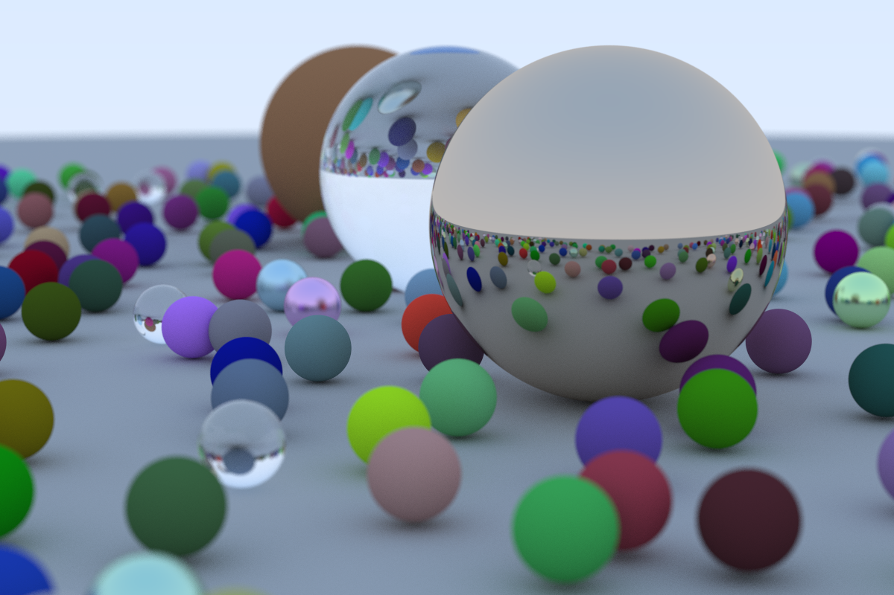
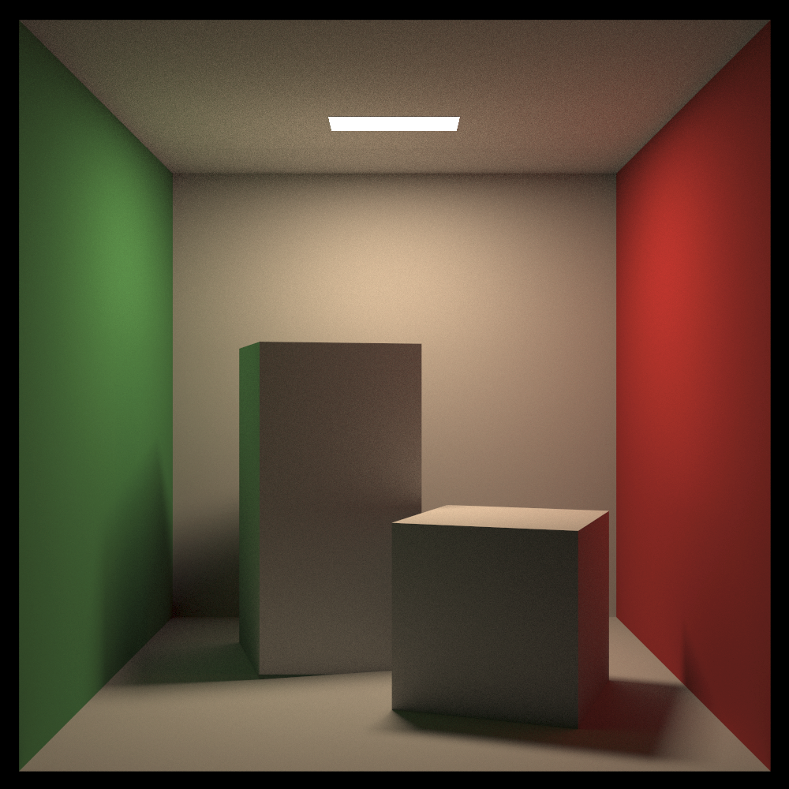
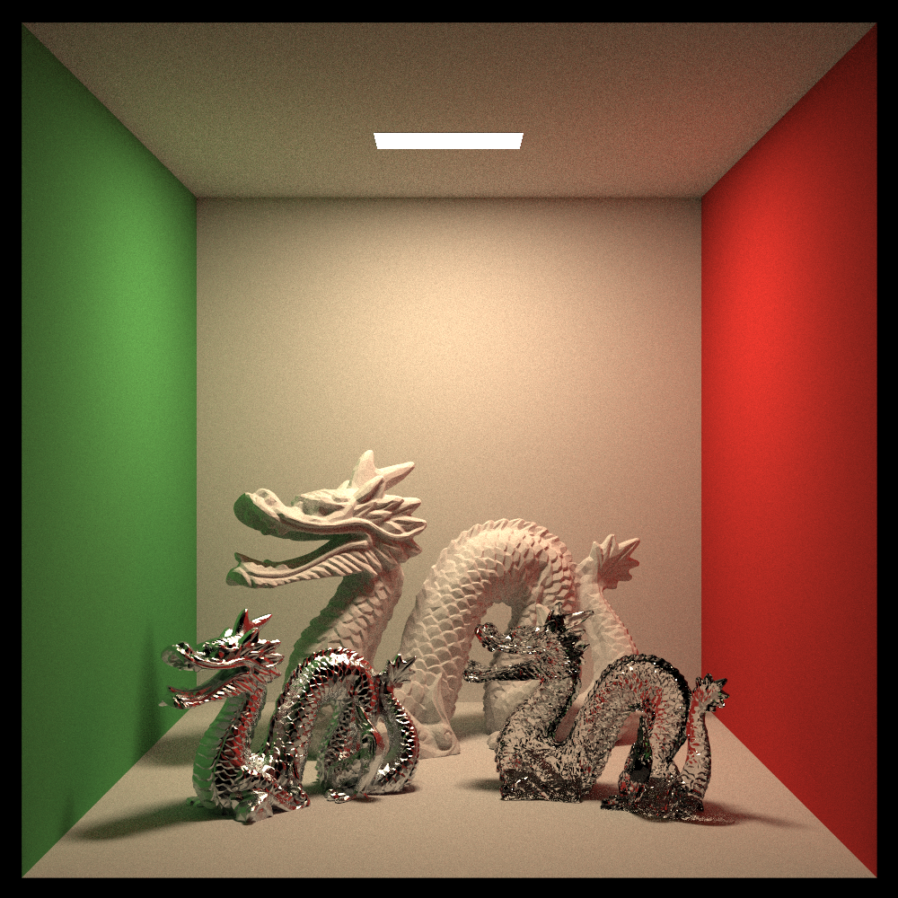

# rust-raytracer

A Monte-Carlo path tracer written in Rust. Based on Pete Shirley's [_Ray Tracing in One Weekend Series_](https://raytracing.github.io/). With some additional features:

* Triangle Meshes
* Multi-threading
* GUI preview window with save to PNG
* Tile-based rendering

## Images

## Cover 

## Cornell Box

## Stanford Dragon Material

